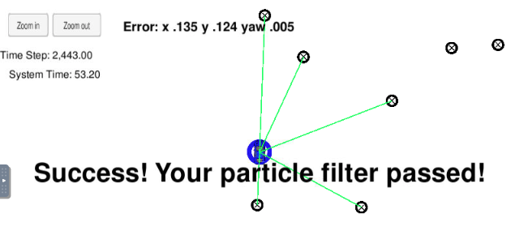
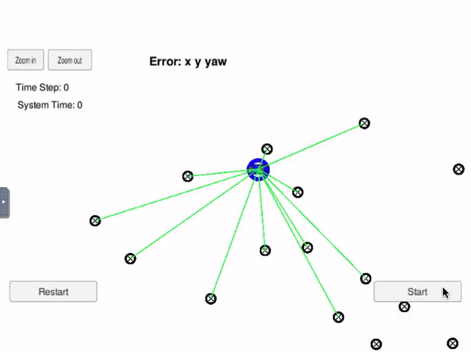

# Kidnapped Vehicle Project
Self-Driving Car Engineer Nanodegree Program

## Project Introduction
This project is an implementation of a 2 dimensional particle filter in C++ for a car that has been kidnapped and transported to a new location! Luckily it has a map of this location, a (noisy) GPS estimate of its initial location, and lots of (noisy) sensor and control data.

  

## Running the Code
This project involves the Term 2 Simulator which can be downloaded [here](https://github.com/udacity/self-driving-car-sim/releases)

This repository includes two files that can be used to set up and install uWebSocketIO for either Linux or Mac systems. For windows you can use either Docker, VMware, or even Windows 10 Bash on Ubuntu to install uWebSocketIO.

Once the install for uWebSocketIO is complete, the main program can be built and ran by doing the following from the project top directory.

1. mkdir build
2. cd build
3. cmake ..
4. make
5. ./particle_filter

Alternatively some scripts have been included to streamline this process, these can be leveraged by executing the following in the top directory of the project:

1. ./clean.sh
2. ./build.sh
3. ./run.sh

Tips for setting up your environment can be found [here](https://classroom.udacity.com/nanodegrees/nd013/parts/40f38239-66b6-46ec-ae68-03afd8a601c8/modules/0949fca6-b379-42af-a919-ee50aa304e6a/lessons/f758c44c-5e40-4e01-93b5-1a82aa4e044f/concepts/23d376c7-0195-4276-bdf0-e02f1f3c665d)

Note that the programs that need to be written to accomplish the project are src/particle_filter.cpp, and particle_filter.h

The program main.cpp has already been filled out, but feel free to modify it.

Here is the main protocol that main.cpp uses for uWebSocketIO in communicating with the simulator.

INPUT: values provided by the simulator to the c++ program

| **INPUT** | Definition |
|:---------:|:---------:|
| sense_x | x position |
| sense_y | y position |
| sense_theta | Measured heading (yaw) angle |
| previous_velocity | Previous velocity |
| previous_yawrate | Previous yaw rate|
| sense_observations_x | Noisy observation data of x positionfrom the simulator|
| sense_observations_h | Noisy observation data of y positionfrom the simulator|

| **OUTPUT** | Definition |
|:---------:|:---------:|
| best_particle_x | Best particle value for position x |
| best_particle_y | Best particle value for position y |
| best_particle_theta | Best particle value for yaw angle |
| best_particle_associations | Best (x,y) sensed positions ID label |
| best_particle_sense_x | List of sensed x positions |
| best_particle_sense_y | List of sensed y positions |


# Implementing the Particle Filter
The directory structure of this repository is as follows:

```
root
|   build.sh
|   clean.sh
|   CMakeLists.txt
|   README.md
|   run.sh
|
|___data
|   |   
|   |   map_data.txt
|   
|   
|___src
    |   helper_functions.h
    |   main.cpp
    |   map.h
    |   particle_filter.cpp
    |   particle_filter.h
```

The only file you should modify is `particle_filter.cpp` in the `src` directory. The file contains the scaffolding of a `ParticleFilter` class and some associated methods. Read through the code, the comments, and the header file `particle_filter.h` to get a sense for what this code is expected to do.

If you are interested, take a look at `src/main.cpp` as well. This file contains the code that will actually be running your particle filter and calling the associated methods.

## Inputs to the Particle Filter
The data `map_data.txt` is given in the `data` directory.

#### The Map
`map_data.txt` includes the position of landmarks (in meters) on an arbitrary Cartesian coordinate system. Each row has three columns
1. x position
2. y position
3. landmark id

### All other data the simulator provides, such as observations and controls.

> * Map data provided by 3D Mapping Solutions GmbH.

## Success Criteria
If your particle filter passes the current grading code in the simulator (you can make sure you have the current version at any time by doing a `git pull`), then you should pass!

The things the grading code is looking for are:

1. **Accuracy**: your particle filter should localize vehicle position and yaw to within the values specified in the parameters `max_translation_error` and `max_yaw_error` in `src/main.cpp`.

2. **Performance**: your particle filter should complete execution within the time of 100 seconds.

## The Results
After full implementation is conducted in `particle_filter.cpp' two different number of particles were tried. Initially 10 particles were set and the pipeline was run. It was successful however then 20 particles were set so as to check whether there will be dramatic reduction in errors.  
See the results below:  

**Number of particles:10**
| Param | Error  |
| ----- | ------ |
|  x    | 0.178  |
|  y    | 0.155  |
|  yaw  | 0.006  |


  
---  


**Number of particles:20**
| Param | Error  |
| ----- | ------ |
|  x    | 0.135  |
|  y    | 0.124  |
|  yaw  | 0.005  |
  

  
  

**Note that** the simulation images given here are **5 times faster!**

## Conclusion
The overall pipeline works well. By increasing the number of particles initialized, the errors can be recuded. However, keep in mind that increasing the number of particles will increase the computation time.